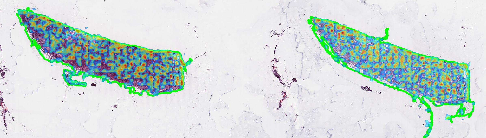

# Intercepting Driver Mutations in WSI

A deep learning approach for identifying BRCA gene over-expression and predicting overall survival in breast cancer patients using whole-slide histopathological images.

## 📋 Table of Contents
- [Overview](#overview)
- [Features](#features)
- [Dataset](#dataset)
- [Models](#models)
- [Results](#results)
- [Visualization](#visualization)

## 🔬 Overview

This project develops computational models to extract clinically relevant information from histopathological images for breast cancer molecular stratification. Our approach focuses on two main objectives:

1. **BRCA Expression Classification**: Distinguishing between breast cancer patients with BRCA1/BRCA2 over-expression vs. under-expression
2. **Overall Survival Prediction**: Predicting clinical outcomes by integrating visual and molecular data

## ✨ Features

- **Multiple Instance Learning (MIL)** architectures for WSI analysis
- **Multimodal fusion** of histopathological images and genomic data
- **Attention visualization** for model interpretability
- **Cross-modal learning** with Cross-Modal Associating Branch (CAB)
- **Robust evaluation** using stratified K-fold cross-validation

## 📊 Dataset

The project uses data from the **TCGA-BRCA cohort** obtained through the Genomic Data Commons (GDC) portal:

- **Images**: Whole-slide histopathological images
- **Molecular data**: BRCA1/BRCA2 gene expression values
- **Normalization metrics**: TPM unstranded and FPKM unstranded
- **Labeling strategy**: Data-driven threshold based on expression distribution mode

### Data Preprocessing
- Threshold-based classification using probability distribution analysis
- Class balancing considerations for over-expression vs. under-expression
- Feature extraction using UNI embeddings (n_patches × 1024)

## 🤖 Models

### BRCA Expression Classification

#### 1. ABMIL (Attention-based MIL)
- Gated attention mechanism with linear dimensionality reduction
- Attention computation: `att = exp{W^T tanh(Vh^T) ⊙ σ(Uh^T)} / Σ exp{...}`

#### 2. DSMIL (Dual-Stream MIL)
- Two-stream architecture with instance and bag classifiers
- Critical instance extraction for bag representation

#### 3. DS ABMIL (Our Contribution)
- Novel hybrid approach combining DSMIL structure with ABMIL attention
- Most robust performance across hyperparameter variations

### Survival Prediction

#### 1. MCAT (Modality Complementary Attention Transformer)
- Cross-modal co-attention for visual and genomic fusion
- Enhanced with Cross-Modal Associating Branch (CAB)

#### 2. G-HANet (Genomic Attention-based Hierarchical Network)
- Multi-level attention mechanisms
- Source of inspiration for CAB integration

#### 3. SurvPath
- Biologically-informed architecture with pathway modeling
- Graph Neural Network processing of molecular interactions

### Requirements
- Python 3.8+
- PyTorch 1.9+
- torchvision
- pandas
- numpy
- scikit-learn
- matplotlib
- seaborn
- opencv-python

## 📈 Results

### BRCA Expression Classification Performance

| Model | Accuracy | Precision | Recall | AUC-ROC | True Positive Rate |
|-------|----------|-----------|---------|---------|-------------------|
| ABMIL | 0.682 ± 0.016 | 0.699 ± 0.004 | 0.918 ± 0.041 | 0.620 ± 0.012 | 0.214 ± 0.039 |
| DSMIL | 0.695 ± 0.008 | 0.700 ± 0.007 | 0.950 ± 0.019 | 0.633 ± 0.012 | 0.189 ± 0.038 |
| **DS ABMIL** | **0.684 ± 0.009** | **0.703 ± 0.012** | **0.906 ± 0.038** | **0.621 ± 0.018** | **0.237 ± 0.074** |

### Survival Prediction Performance (C-Index)

| Model | Max C-Index | Mean ± Std |
|-------|-------------|-------------|
| MCAT | 0.696 | 0.578 ± 0.131 |
| **MCAT + CAB** | **0.719** | **0.578 ± 0.085** |
| SurvPath | 0.772 | 0.656 ± 0.119 |
| SurvPath + CAB | 0.733 | 0.564 ± 0.132 |

## 🔍 Visualization

The project includes comprehensive attention visualization capabilities:

### Patch-Level Attention
- Normalized attention scores overlaid on WSI thumbnails
- Heat-map visualization showing region importance

### Inner-Patch Activation
- ResNet50-based activation mapping within patches
- Gaussian smoothing for seamless visualization
- Threshold filtering for high-confidence regions

## 📋 Key Findings

1. **Class Imbalance Challenge**: All models struggle with under-expressed class detection due to dataset imbalance
2. **Parameter Sensitivity**: Increased model complexity often leads to overfitting on the dominant class
3. **DS ABMIL Robustness**: Our hybrid model shows superior stability across hyperparameter variations
4. **CAB Effectiveness**: Cross-Modal Associating Branch improves MCAT performance but shows limited benefit in SurvPath
5. **Attention Interpretability**: Generated visualizations provide valuable insights into model decision-making

