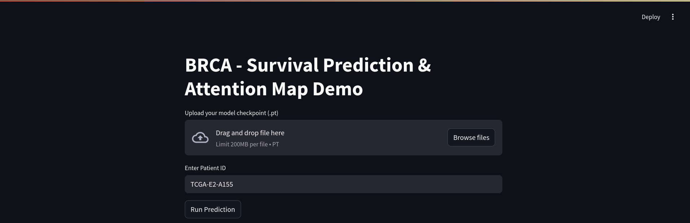
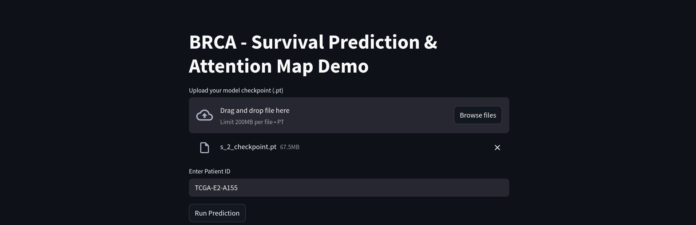
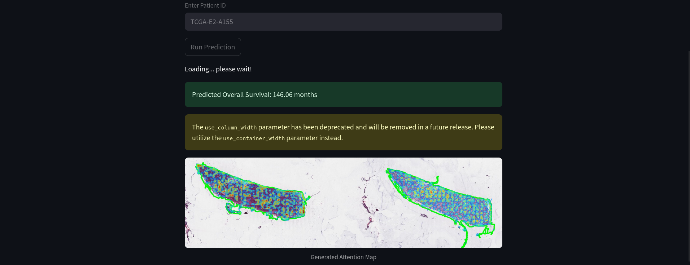
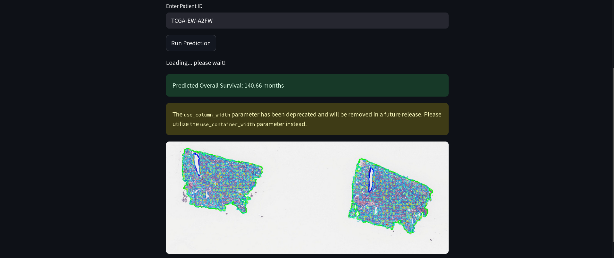

## How to Run Overall Survival demo

### 1. Submit the Demo Job

To start the demo, simply run the following command from the project directory:

```bash
sbatch demoOS.sh
```

This will submit a job to the cluster which runs the demo server (e.g., a Streamlit app) on a specific node.
### 2. Set Up Port Forwarding in VSCode

Once the job starts, check the node name where it is running (e.g., ajeje or pippobaudo). Then, in VSCode:

1. Go to the Port Forwarding tab.
2.  Add a forwarded port with this format:
```bash
node_name:8501
```
Example:
```bash
ajeje:8501
```
  Make sure port ```8501``` is open and not used by other processes.

### 3. Access the Demo Locally

After port forwarding is set up, open your browser and navigate to:

http://localhost:8501

You should now see the current interface: 

### 4. Select the Model Weights and Enter Patient ID

Once the demo interface is visible at `http://localhost:8501`, follow these steps:

1. **Select the model MCAT weights**  
   At the top of the interface, you'll find a file selector or dropdown to choose the model weights.  
   You can download the available weight files from the following link:

   👉 [Download model weights from Google Drive](https://drive.google.com/drive/folders/1AEz8LCSWBxUGjOxhNfpERG4iOjh6uh1H?usp=drive_link)


2. **Enter the Patient ID**  
   Below the model selection, there will be a field where you can input a **Patient ID**.  
   This ID should match one of the available cases in the dataset used by the model.

3. **Run the analysis**  
   After selecting the weights and entering the patient ID, click on "Run Prediction" in order to display the results.

> ⚠️ If no weights are selected or the patient ID is invalid, the application may show an error or fail to produce results.



### 5. Results
- Patient ID: TCGA-E2-A155 
- Patient ID: TCGA-EW-A2FW 
  
## Overall Survival evaluation
This notebook contains the results exactly as presented in the paper.

📍 Path to the notebook:  
`/work/ai4bio2024/brca_surv/survival/evaluation.ipynb`
